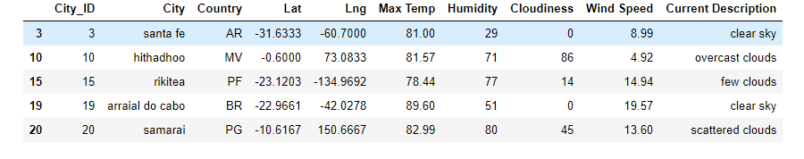
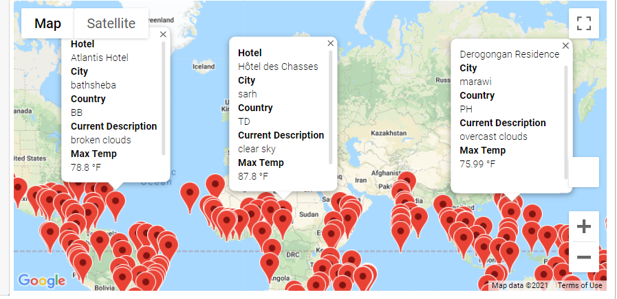
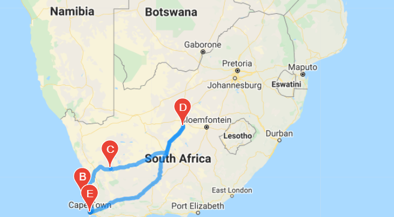
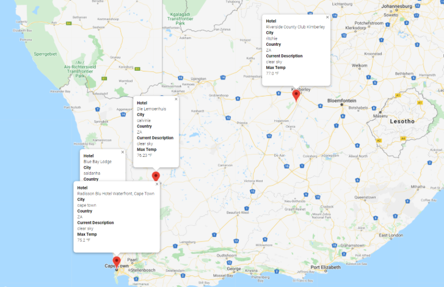

# *Map IT!*  || PlanMyTrip, Hotel and Lodging App, WeatherPy Analysis  

## Overview of Project

Retrieval and analysis of weather data for PlanMyTrip, a travel company specializing in internet related services in the hotel and lodging industry, to which will be used to recommend ideal hotels based on clients' weather preferences.

Analysis consisted of data pull of over 1500 latitudes and longtiudes (cities worldwide) based on the following weather criteria: tempartures, humidity, wind speed, cloudiness, and current description. 

Hotel Information was later added to give users an "ideal" place to vacation inclusive of city and country. 

A user prompt was coded to reutrn "real-time" results based on desired input of minimum and maximum temperatures. 

### Resources

• Data Source (s): WeatherPy_vacation.csv*, WeatherPy_Database.csv, cities.csv

• Software: Python 3.7.6 64-bit | Python Libaries: Pandas, Matplotlib, SciPy, NumPy, Requests, Gmaps | CityPy (package) | Jupyter Notebook | Anaconda | OpenWeatherMap API, Goggle Maps and Places API |JSON Traversals 

 * **Note(s)**:  
    * File Folder: weather_search: 
        *  Hotel _Casa do Ian😎_: Jacareacanga, BR from file WeatherPy_vacation.csv, appears as this: Casa do Ian😎  with a emoji at the end of the name when viewed on GitHub.

    * Weather information, specfically, will vary pending on **_when_** data was pulled. 

### Results 

Beta testing yielded the succeeding outcomes:

  <i><b> User Prompt, Minimum Temperature  </b></i> 
 

  

  <i><b> 
User Prompt, Maximum Temperature </b></i> 
 

  

***

  <i><b> 
Matched Cities (BackEnd) </b></i> 
 

  

  <i><b> 
Marker Map (FrontEnd-Userview) </b></i> 
 

  

***

  <i><b> 
Travel Itinerary, Country: South Africa, By Directions: Driving </b></i> 
 

  

  <i><b> 
Travel Itinerary, Country: South Africa, User Choice of Four Cities</b></i> 
 

  

***

#### Author
_Whitney D. Gardner_
